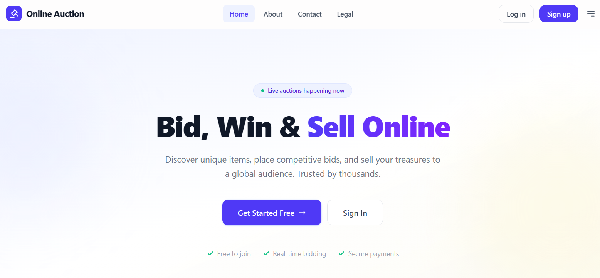
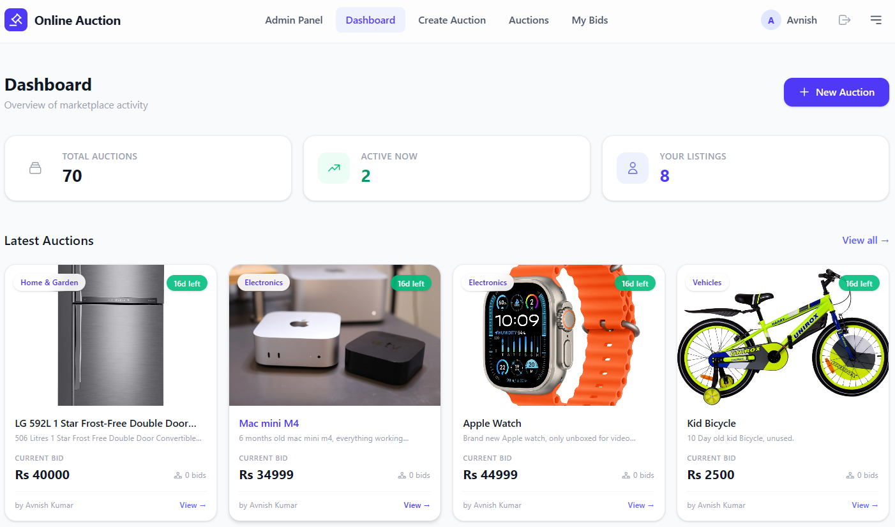
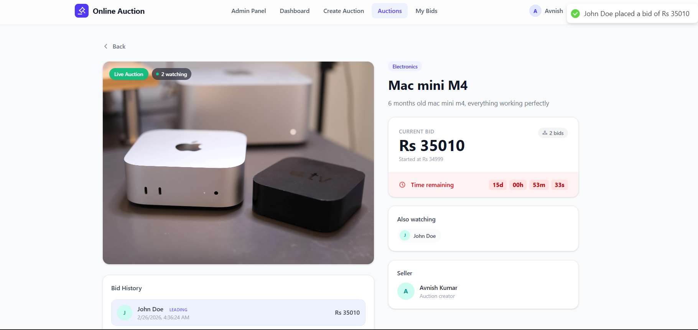
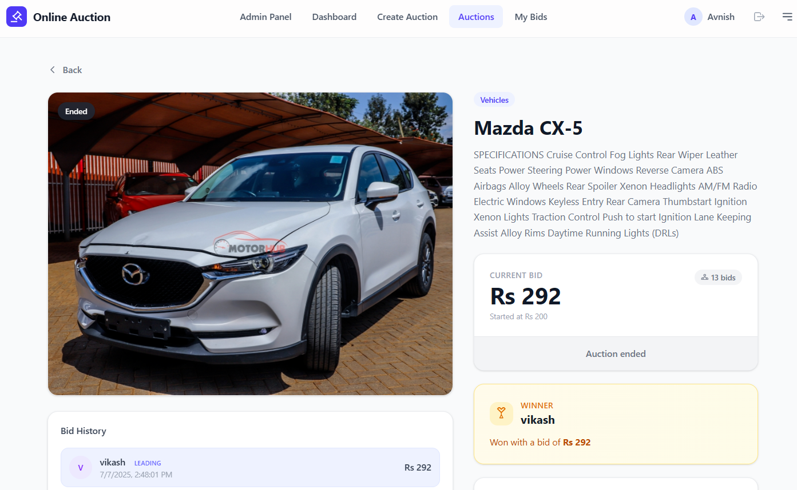
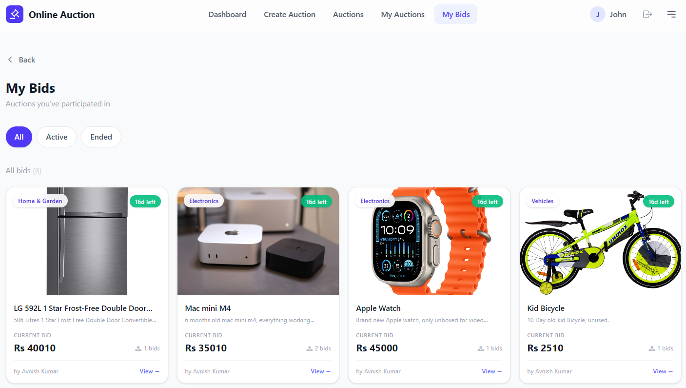
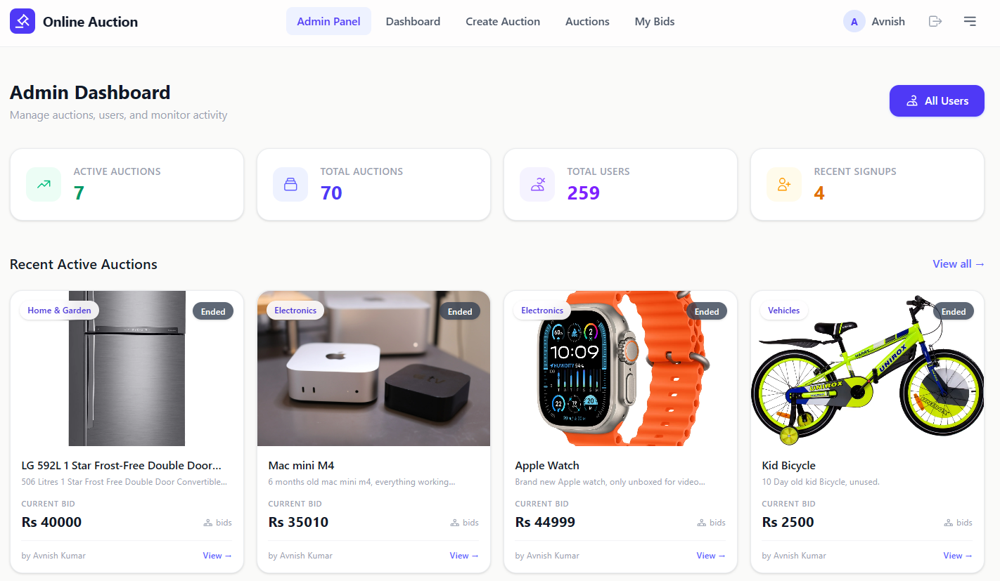

# Online Auction System — Frontend

> React 19 SPA with real-time bidding via Socket.io, TanStack React Query data layer, Redux Toolkit auth, Tailwind CSS v4, and View Transitions API page animations.

---

## Table of Contents

- [Architecture Overview](#architecture-overview)
- [Getting Started](#getting-started)
- [Project Structure](#project-structure)
- [Environment Variables](#environment-variables)
- [Routing](#routing)
- [State Management](#state-management)
- [Data Fetching](#data-fetching)
- [Real-time Bidding](#real-time-bidding-socketio)
- [Hooks Reference](#hooks-reference)
- [Components](#components)
- [Pages](#pages)
- [Performance Optimizations](#performance-optimizations)
- [Styling](#styling)
- [Deployment](#deployment)

---

## Architecture Overview

```
                    ┌─────────────────────────────────────────────┐
                    │                  React App                  │
                    │                                             │
                    │  ┌──────────┐  ┌──────────┐  ┌──────────┐  │
                    │  │  Redux   │  │  React   │  │ Socket.io│  │
                    │  │ Toolkit  │  │  Query   │  │  Client  │  │
                    │  │  (Auth)  │  │  (Data)  │  │ (RT Bids)│  │
                    │  └────┬─────┘  └────┬─────┘  └────┬─────┘  │
                    │       │             │              │        │
                    │       └──────┬──────┘              │        │
                    │              │                     │        │
                    │  ┌───────────▼──────────┐          │        │
                    │  │    Services Layer    │          │        │
                    │  │   (Axios + api.js)   │          │        │
                    │  └───────────┬──────────┘          │        │
                    └──────────────┼──────────────────┬──┘        │
                                   │                  │           │
                              HTTP │           WebSocket          │
                                   │                  │           │
                    ┌──────────────▼──────────────────▼───────────┘
                    │          Express + Socket.io Server          │
                    └─────────────────────────────────────────────┘
```

### Data Flow

| Concern            | Tool                 | Flow                                                             |
| ------------------ | -------------------- | ---------------------------------------------------------------- |
| **Authentication** | Redux Toolkit        | `authSlice` → `checkAuth` on mount → httpOnly cookies            |
| **Server data**    | TanStack React Query | `hooks/` → `services/` → `config/api.js` (Axios) → Server        |
| **Real-time bids** | Socket.io client     | `useSocket` hook → `config/socket.js` → WebSocket → Server rooms |
| **UI state**       | React local state    | Component-level `useState` / `useEffect`                         |

---

## Getting Started

```bash
cd client
npm install
```

Create a `.env` file:

```env
VITE_API=http://localhost:3000
VITE_AUCTION_API=http://localhost:3000/auction
```

Then start the dev server:

```bash
npm run dev
```

The app runs at `http://localhost:5173` by default.

---

## Project Structure

```
src/
├── main.jsx                  → App entry point (providers, router)
├── index.css                 → Tailwind import + base styles + view transitions
├── Error.jsx                 → 404 error boundary page
│
├── config/
│   ├── api.js                → Axios instance (baseURL, withCredentials)
│   └── socket.js             → Socket.io singleton (connect, disconnect, getSocket)
│
├── store/                    → Redux Toolkit (auth only)
│   ├── store.js              → configureStore
│   └── auth/
│       └── authSlice.js      → checkAuth, login, signup, logout thunks
│
├── services/                 → API call functions (pure, no hooks)
│   ├── auction.service.js    → CRUD auctions, bids, stats
│   ├── admin.service.js      → Dashboard, users, roles
│   ├── user.service.js       → Password change, login history
│   └── contact.service.js    → Contact form submission
│
├── hooks/                    → React Query hooks (main data layer)
│   ├── useAuction.js         → 8 hooks + prefetch handlers
│   ├── useAdmin.js           → 5 hooks (dashboard, users, mutations)
│   ├── useUser.js            → 2 hooks (password, login history)
│   ├── useContact.js         → 1 hook (send message)
│   └── useSocket.js          → Real-time auction room hook
│
├── init/
│   └── InitAuth.jsx          → Auth check on app mount (runs once)
│
├── layout/
│   ├── MainLayout.jsx        → Protected layout (redirects to /login)
│   ├── OpenLayout.jsx        → Public layout (no auth required)
│   └── AdminLayout.jsx       → Admin layout
│
├── routers/
│   ├── protectedRoutes.jsx   → Authenticated user routes
│   ├── openRoutes.jsx        → Public routes (landing, login, legal)
│   └── adminRouter.jsx       → Admin panel routes
│
├── components/
│   ├── Navbar.jsx            → Responsive navbar + slide-out drawer + prefetch
│   ├── Footer.jsx            → Site footer
│   ├── AuctionCard.jsx       → Auction preview card with hover prefetch
│   ├── DialogBox.jsx         → Confirmation dialog
│   ├── LoadingScreen.jsx     → Full-screen loading spinner
│   ├── AdsComponent.jsx      → Google AdSense integration
│   └── Landing/
│       ├── Hero.jsx          → Landing hero section
│       ├── Features.jsx      → Feature highlights
│       ├── Auction.jsx       → Sample auction showcase
│       └── CTA.jsx           → Call-to-action section
│
├── pages/
│   ├── Landing.jsx           → Landing (guest) or Dashboard (logged in)
│   ├── Login.jsx             → Login form
│   ├── Signup.jsx            → Registration form
│   ├── Dashboard.jsx         → User dashboard with stats
│   ├── AuctionList.jsx       → Browse all active auctions
│   ├── CreateAuction.jsx     → Create new auction form
│   ├── ViewAuction.jsx       → Auction detail + live bidding
│   ├── MyAuction.jsx         → User's created auctions
│   ├── MyBids.jsx            → User's bid history
│   ├── Profile.jsx           → Profile settings + password change
│   ├── Privacy.jsx           → Login history + security settings
│   ├── Contact.jsx           → Contact form
│   ├── About.jsx             → About page
│   └── Admin/
│       ├── AdminDashboard.jsx → Admin stats + recent data
│       └── UsersList.jsx      → User management table
│
└── utils/
    └── ScrollToTop.jsx       → Scroll restoration on navigation
```

---

## Environment Variables

| Variable           | Required | Description          | Example                         |
| ------------------ | -------- | -------------------- | ------------------------------- |
| `VITE_API`         | **Yes**  | Backend API base URL | `http://localhost:3000`         |
| `VITE_AUCTION_API` | **Yes**  | Auction API base URL | `http://localhost:3000/auction` |

---

## Routing

The app uses **React Router v7** with three route groups merged into a single `createBrowserRouter`:

### Public Routes (`OpenLayout`)

| Path                           | Page            | Description                          |
| ------------------------------ | --------------- | ------------------------------------ |
| `/`                            | Landing         | Hero, features, sample auctions, CTA |
| `/login`                       | Login           | Email/password login form            |
| `/signup`                      | Signup          | Registration form                    |
| `/contact`                     | Contact         | Contact form (works without auth)    |
| `/about`                       | About           | Project information                  |
| `/legal`                       | Legal           | Legal documents hub                  |
| `/legal/terms-of-service`      | Terms           | Terms of service                     |
| `/legal/privacy-policy`        | Privacy Policy  | Privacy policy                       |
| `/legal/dmca`                  | DMCA            | DMCA policy                          |
| `/legal/code-of-conduct`       | Code of Conduct | Community guidelines                 |
| `/legal/acceptable-use-policy` | Acceptable Use  | Usage policy                         |

### Protected Routes (`MainLayout`)

Redirects to `/login` if not authenticated.

| Path           | Page          | Description                                                   |
| -------------- | ------------- | ------------------------------------------------------------- |
| `/`            | Dashboard     | Stats, recent auctions (replaces landing for logged-in users) |
| `/auction`     | AuctionList   | Browse all active auctions with pagination                    |
| `/create`      | CreateAuction | Create new auction with image upload                          |
| `/auction/:id` | ViewAuction   | Auction detail with live bidding                              |
| `/myauction`   | MyAuction     | User's own auctions                                           |
| `/mybids`      | MyBids        | Auctions the user has bid on                                  |
| `/profile`     | Profile       | Profile settings, change password                             |
| `/privacy`     | Privacy       | Login history, security settings                              |

### Admin Routes (`AdminLayout`)

| Path           | Page           | Description                                 |
| -------------- | -------------- | ------------------------------------------- |
| `/admin`       | AdminDashboard | Platform-wide stats                         |
| `/admin/users` | UsersList      | User management with search/sort/pagination |

### Route Priority

Routes are merged in order: `adminRouter` → `protectedRoutes` → `openRoutes`. The landing page (`/`) conditionally renders the Dashboard for authenticated users or the public landing page for guests.

---

## State Management

### Redux Toolkit — Authentication Only

```
store/
├── store.js          → Single reducer: auth
└── auth/
    └── authSlice.js  → 4 async thunks + loading/error states
```

| Thunk       | Trigger              | What it does                                 |
| ----------- | -------------------- | -------------------------------------------- |
| `checkAuth` | App mount (InitAuth) | `GET /user` → hydrate user from cookie       |
| `login`     | Login form submit    | `POST /auth/login` → `GET /user` → set user  |
| `signup`    | Signup form submit   | `POST /auth/signup` → `GET /user` → set user |
| `logout`    | Navbar logout button | `POST /auth/logout` → clear user             |

**State shape:**

```javascript
{
  user: null | { user: { _id, name, email, avatar, role } },
  loading: boolean,
  error: null | string
}
```

### InitAuth Wrapper

`InitAuth` runs `checkAuth()` once on mount (via `useRef` guard). It shows a loading screen until the auth check completes, enabling automatic session restoration from httpOnly cookies.

### Why Not Redux for Everything?

Server state (auctions, bids, stats) is managed by **React Query** — it handles caching, background refetching, stale-while-revalidate, and pagination automatically. Redux is reserved for client-only global state (auth).

---

## Data Fetching

### Service Layer Pattern

```
Page/Component → Hook (useAuction.js) → Service (auction.service.js) → Axios (api.js) → Server
```

**Services** are pure async functions that return data:

```javascript
// services/auction.service.js
export const getAuctions = async ({ page = 1, limit = 12 } = {}) => {
  const res = await api.get(`/auction?page=${page}&limit=${limit}`);
  return res.data;
};
```

**Hooks** wrap services in React Query:

```javascript
// hooks/useAuction.js
export const useGetAuctions = (page = 1) => {
  return useQuery({
    queryKey: ["auctions", page],
    queryFn: () => getAuctions({ page }),
    keepPreviousData: true,
  });
};
```

### Query Keys

| Key                    | Used by        | Invalidated when              |
| ---------------------- | -------------- | ----------------------------- |
| `["auctions", page]`   | AuctionList    | Bid placed, auction created   |
| `["myAuctions", page]` | MyAuction      | Bid placed, auction created   |
| `["myBids", page]`     | MyBids         | Bid placed                    |
| `["auction", id]`      | ViewAuction    | Bid placed on this auction    |
| `["dashboardStats"]`   | Dashboard      | Bid placed, auction created   |
| `["loginHistory"]`     | Privacy        | —                             |
| `["adminDashboard"]`   | AdminDashboard | User role change, user delete |
| `["allUsers", ...]`    | UsersList      | User role change, user delete |

---

## Real-time Bidding (Socket.io)

### Connection Management

`config/socket.js` provides a **singleton pattern** — one socket instance reused across the app:

```javascript
const socket = io(SOCKET_URL, {
  withCredentials: true, // Send cookies for JWT auth
  autoConnect: false, // Connect only when needed
  transports: ["websocket", "polling"],
  reconnection: true,
  reconnectionAttempts: 10,
});
```

### useSocket Hook

Used in `ViewAuction` to subscribe to a specific auction room:

```javascript
const { activeUsers, liveAuction, socketError, isConnected } = useSocket(
  auctionId,
  currentUserId,
);
```

| Return value  | Type           | Description                          |
| ------------- | -------------- | ------------------------------------ |
| `activeUsers` | `Array`        | Users currently viewing this auction |
| `liveAuction` | `Object\|null` | Updated auction data after a bid     |
| `socketError` | `string\|null` | Error message (auto-clears after 5s) |
| `isConnected` | `boolean`      | Socket connection status             |

### Event Flow

```
ViewAuction mounts
  → connectSocket()
  → socket.emit("auction:join", { auctionId })
  → Listen for "auction:bidPlaced", "auction:userJoined", "auction:userLeft"
  → Toast notifications for other users' actions
  → On unmount: socket.emit("auction:leave", { auctionId })
```

### Toast Notifications

| Event            | Toast                              | Shown to                 |
| ---------------- | ---------------------------------- | ------------------------ |
| User joins room  | `"Alice joined the auction" 👋`    | Other users              |
| User leaves room | `"Alice left the auction" 🚪`      | Other users              |
| Bid placed       | `"Alice placed a bid of Rs 505" ✓` | Other users              |
| Error            | Error message                      | Only the requesting user |

---

## Hooks Reference

### `useAuction.js` — 8 exports + prefetch

| Hook                        | Type     | Description                                         |
| --------------------------- | -------- | --------------------------------------------------- |
| `useGetAuctions(page)`      | Query    | Paginated active auctions                           |
| `useGetMyAuctions(page)`    | Query    | User's created auctions                             |
| `useGetMyBids(page)`        | Query    | Auctions user has bid on                            |
| `useViewAuction(id)`        | Query    | Single auction details                              |
| `useDashboardStats()`       | Query    | Dashboard statistics                                |
| `usePlaceBid()`             | Mutation | Place a bid (invalidates 5 queries)                 |
| `useCreateAuction(options)` | Mutation | Create auction with callbacks                       |
| `usePrefetchHandlers()`     | Utility  | Returns 5 prefetch functions for hover optimization |

### `useAdmin.js` — 5 exports

| Hook                                                           | Type     | Description                      |
| -------------------------------------------------------------- | -------- | -------------------------------- |
| `useAdminDashboard()`                                          | Query    | Admin platform stats             |
| `useGetAllUsers(page, search, role, limit, sortBy, sortOrder)` | Query    | Paginated user list with filters |
| `useUpdateUserRole()`                                          | Mutation | Change user role                 |
| `useDeleteUser()`                                              | Mutation | Delete user                      |
| `useToggleUserStatus()`                                        | Mutation | Toggle user active/inactive      |

### `useUser.js` — 2 exports

| Hook                         | Type     | Description           |
| ---------------------------- | -------- | --------------------- |
| `useChangePassword(options)` | Mutation | Change password       |
| `useLoginHistory()`          | Query    | Last 10 login records |

### `useContact.js` — 1 export

| Hook                      | Type     | Description         |
| ------------------------- | -------- | ------------------- |
| `useSendMessage(options)` | Mutation | Submit contact form |

### `useSocket.js` — 1 export

| Hook                           | Type   | Description                         |
| ------------------------------ | ------ | ----------------------------------- |
| `useSocket(auctionId, userId)` | Effect | Real-time auction room subscription |

---

## Components

### Navbar

Responsive navigation with:

- **Desktop**: Horizontal nav links (role-aware: user vs admin) + profile avatar + logout
- **Mobile**: Slide-out drawer with full navigation, user profile section, overlay backdrop
- **Hover prefetch**: `onMouseEnter` triggers data prefetching for linked pages
- **Role-based links**: Admin users see "Admin Panel" link; regular users see full menu

### AuctionCard

Reusable auction preview card with:

- Image with hover zoom effect
- Category and time-left badges
- Current bid price and bid count
- Seller name
- **View Transitions API**: `viewTransition` prop on `<Link>` for page cross-fade
- **Hover prefetch**: Prefetches auction detail data on mouse enter

### Footer

Minimal site footer with links to About, Legal, Contact.

### LoadingScreen

Full-screen centered spinner used during initial auth check and lazy-loaded routes.

### DialogBox

Confirmation modal with "Delete" / "Cancel" actions and double-click prevention.

---

## Pages

### Landing

Conditional rendering based on auth state:

- **Guest**: Hero section + sample auctions + features + CTA
- **Authenticated**: Renders the Dashboard component directly



### Dashboard

Stat cards (total auctions, active auctions, your listings) + latest active auctions grid (4 items) + user's auctions grid (4 items) + floating "Create Auction" FAB button.



### ViewAuction

The most complex page — combines:

- Auction details (image, description, category, dates)
- **Live countdown timer** (days/hours/minutes/seconds, updates every second)
- **Real-time active users** count with socket indicator
- **Bid form** with constrained range (currentPrice + 1 to currentPrice + 10)
- **Bid history** list showing all past bids
- **Winner announcement** section for ended auctions
- **Live updates** via `useSocket` — bids from other users appear instantly
- **View Transitions** on back button navigation

|                  Auction Page                   |                 Winner Announcement                 |
| :---------------------------------------------: | :-------------------------------------------------: |
|  |  |

### AuctionList / MyAuction / MyBids

Paginated grid pages with category filtering, back buttons, empty state messages, and consistent 4-per-row layouts on desktop.



### CreateAuction

Full form with 13 categories, date pickers (constrained: start ≥ now, end > start), image upload with preview, starting price input, and tips section.

### Profile

Avatar display, name/email (read-only), change password form with validation (8-char minimum, confirmation match).

### Privacy

Login history table with location, IP, ISP, device info + security settings section.

### Admin Dashboard / UsersList

Platform-wide stats, recent auctions/users, and full user management with search, sorting, role filtering, and pagination.



---

## Performance Optimizations

### Hover Prefetching

The `usePrefetchHandlers()` hook returns functions that prefetch data into React Query's cache:

```javascript
const {
  prefetchAuction,
  prefetchAuctions,
  prefetchMyAuctions,
  prefetchMyBids,
  prefetchDashboard,
} = usePrefetchHandlers();
```

Used in:

- **AuctionCard**: `onMouseEnter` prefetches the auction detail page
- **Navbar links**: `onMouseEnter` prefetches the target page's data

All prefetches use a 30-second `staleTime` to avoid unnecessary refetches.

### View Transitions API

Native browser page transitions with 250ms cross-fade:

- `<Link viewTransition>` on AuctionCard and navigation links
- `document.startViewTransition()` on programmatic navigation (back buttons)
- CSS animation configured in `index.css` for `::view-transition-old/new(root)`

### React Query Caching

- `keepPreviousData: true` on paginated queries prevents layout shift during page changes
- Automatic background refetching keeps data fresh
- Query invalidation on mutations ensures consistency

### Socket.io Singleton

One socket connection shared across the app via `config/socket.js`. Lazy connection — only connects when entering an auction room.

---

## Styling

- **Tailwind CSS v4** via `@tailwindcss/vite` plugin (no PostCSS config needed)
- **Color scheme**: Indigo (primary), Emerald (success), Amber (warning), Stone (background)
- **Design system**: Consistent `rounded-2xl` cards, `rounded-xl` buttons, glass-morphism navbar (`bg-white/70 backdrop-blur-xl`)
- **Responsive**: Mobile-first with `sm:`, `md:`, `lg:` breakpoints
- **Dark backgrounds**: Footer uses `bg-gray-900`
- **Warm base**: `body` uses `bg-stone-50`

---

## Scripts

| Script    | Command        | Description                                     |
| --------- | -------------- | ----------------------------------------------- |
| `dev`     | `vite --host`  | Development server with HMR (accessible on LAN) |
| `build`   | `vite build`   | Production build                                |
| `preview` | `vite preview` | Preview production build                        |
| `lint`    | `eslint .`     | Lint JS/JSX files                               |

---

## Tech Stack

| Library              | Version | Purpose                 |
| -------------------- | ------- | ----------------------- |
| React                | 19.1.0  | UI framework            |
| Vite                 | 6.3.5   | Build tool + dev server |
| Tailwind CSS         | 4.1.7   | Utility-first styling   |
| React Router         | 7.6.1   | Client-side routing     |
| Redux Toolkit        | 2.8.2   | Auth state management   |
| TanStack React Query | 5.77.2  | Server state + caching  |
| Axios                | 1.9.0   | HTTP client             |
| Socket.io Client     | 4.8.3   | Real-time WebSocket     |
| react-hot-toast      | 2.6.0   | Toast notifications     |
| react-icons          | 5.5.0   | Icon library            |

---

## Deployment

### Vercel

The `vercel.json` configures SPA routing (all paths → `index.html`). Just connect the GitHub repo to Vercel and set the environment variables.

### Manual Build

```bash
npm run build    # Outputs to dist/
npm run preview  # Test the build locally
```

The `dist/` folder is a static site that can be deployed to any CDN or static hosting.

---

## License

MIT — see [LICENSE](../LICENSE)
